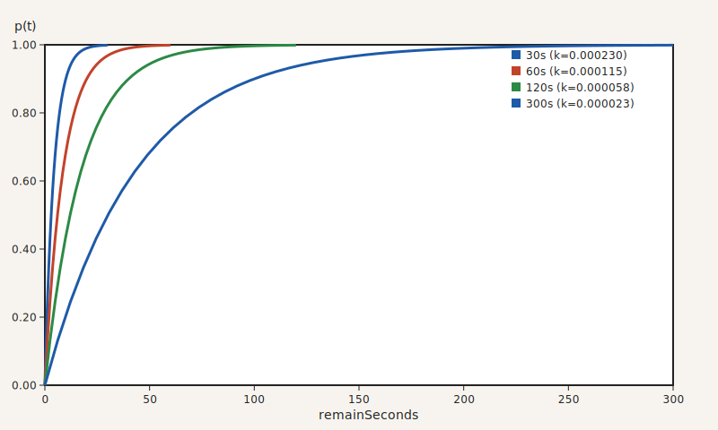

# crema ☕️
A Go cache library with probabilistic revalidation and optional singleflight loading. It smooths refreshes near TTL expiry while deduplicating concurrent loads.

## Features

- Smooth probabilistic revalidation near expiry
- Built-in singleflight loader (can be disabled)
- Zero external dependencies in the core module
- Pluggable storage (`CacheProvider`) and serialization (`SerializationCodec`)

Core functionality is covered by a high level of automated tests.

## Revalidation Algorithm

Within the revalidation window, the cache reloads with probability

```math
p(t)=1-e^{-kt}
```

where `t` is the remaining time. The steepness `k` is set so that $`p(t)=0.999`$ at the configured window boundary, smoothing spikes near expiry.



## Installation

```sh
go get github.com/abema/crema
```

Go 1.22 or newer is recommended.

## Quick Start

```go
provider := newMemoryProvider[int]()
codec := crema.NoopSerializationCodec[int]{}
cache := crema.NewCache(provider, codec)

value, err := cache.GetOrLoad(context.Background(), "answer", time.Minute, func(ctx context.Context) (int, error) {
	// Database or computation logic here
	return 42, nil
})
if err != nil {
	panic(err)
}

println(value)
```

## Usage Notes

- **CacheProvider**: Responsible for persistence with TTL handling. Works with Redis/Memcached, files, or databases.
- **SerializationCodec**: Encodes/decodes cached objects. Swap in JSON, protobuf, or your own codec.
- **CacheObject**: A thin wrapper holding `Value` and absolute expiry (`ExpireAtMillis`).

## Options

- `WithRevalidationWindow(duration)`: Set the revalidation window
- `WithDirectLoader()`: Disable singleflight and call loaders directly
- `WithLogger(logger)`: Override warning logger for get/set failures

## Implementations

### CacheProvider

| Name | Package | Notes | Example |
| --- | --- | --- | --- |
| RistrettoCacheProvider | `github.com/abema/crema/ext/ristretto` | dgraph-io/ristretto backend with TTL support. | [✅](example/ristretto_test.go) |
| ValkeyCacheProvider | `github.com/abema/crema/ext/valkey-go` | Valkey (Redis protocol) backend. | [✅](example/valkey_go_test.go) |
| MemcacheCacheProvider | `github.com/abema/crema/ext/gomemcache` | Memcached backend with TTL handling. | - |
| CacheProvider | `github.com/abema/crema/ext/golang-lru` | hashicorp/golang-lru backend with default TTL. | - |

### SerializationCodec

| Name | Package | Notes | Example |
| --- | --- | --- | --- |
| NoopSerializationCodec | `github.com/abema/crema` | Pass-through codec for in-memory cache objects. | - |
| JSONByteStringCodec | `github.com/abema/crema` | Standard library JSON encoding to `[]byte`. | [✅](example/valkey_go_test.go) |
| JSONByteStringCodec | `github.com/abema/crema/ext/go-json` | goccy/go-json encoding to `[]byte`. | - |
| ProtobufCodec | `github.com/abema/crema/ext/protobuf` | Protobuf encoding to `[]byte`. | [✅](example/protobuf_test.go) |

### MetricsProvider

| Name | Package | Notes | Example |
| --- | --- | --- | --- |
| NoopMetricsProvider | `github.com/abema/crema` | Embedded base used as the default metrics provider. | - |

## Concurrency

`Cache` is goroutine-safe as long as `CacheProvider` and `SerializationCodec` implementations are goroutine-safe.

## Development

```sh
go generate
go test ./...
```

## Tools

- `cmd/plot-revalidation`: SVG plot generator for revalidation curves

## Why "crema"?
Crema is the golden foam that forms on top of a freshly pulled espresso coffee shot. Like crema that gradually dissipates over time, this cache library probabilistically refreshes entries, ensuring your data stays fresh without the overhead of deterministic expiration checks.
